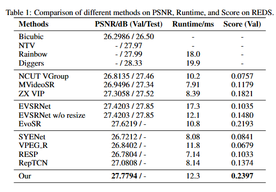
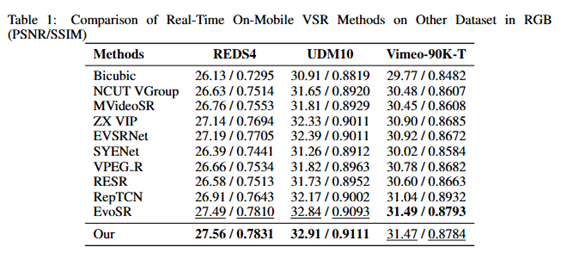
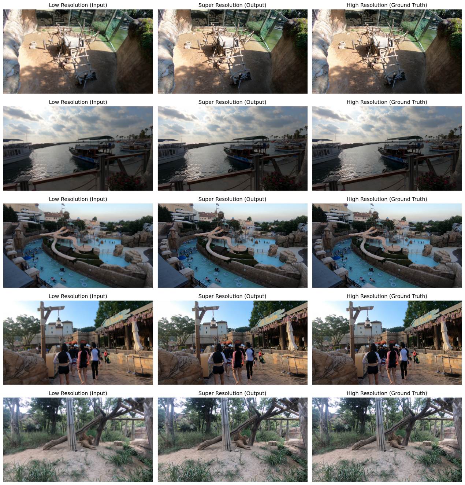

NAS for VSR
Currently, we are actively investigating Neural Architecture Search (NAS) techniques tailored for lightweight Video Super-Resolution (VSR) on mobile platforms. 
Addressing the critical challenge of balancing real-time inference latency with high-fidelity reconstruction quality on resource-constrained devices, 
we have developed an automated architecture search framework. This framework is designed to adaptively identify optimal lightweight network topologies without manual intervention. 
Here are the preliminary experimental results:

Preliminary experimental results indicate that this approach significantly reduces computational delay while preserving superior super-resolution performance, 
demonstrating substantial potential for practical deployment. In future work, we aim to further enhance the efficiency of our search strategies and expand the 
diversity of the search space. Furthermore, we plan to generalize this automated framework to a broader range of resource-limited edge computing scenarios and 
related low-level vision tasks, thereby facilitating more extensive real-world applications. We welcome your attention to our future work.

